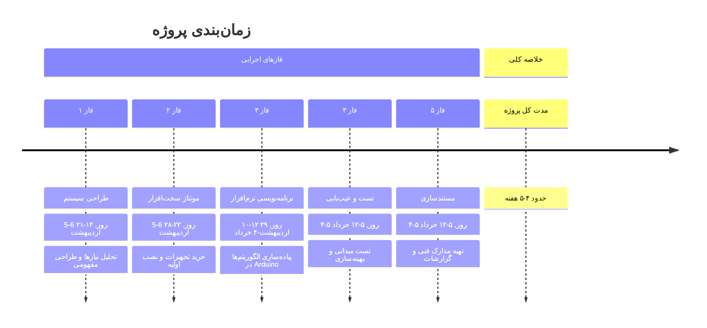

---
layout: intro
class: pl-30
glowSeed: 14
---

<h1 flex="~ col">
<!-- 
 -->
  <!-- پروژه درس IoT , استاد باطنی -->
<!-- 
 -->

 هشدار دهنده مصرف انرژی در زمان قطعی برق 

</h1>

  
Ordibehesht 13, 1404

---
---

# مقدمه

  
    
زمینه
 
    رشد سیستم‌های هوشمند در منازل/محیط‌های کاری نیاز به راهکارهای پیشرفته برای افزایش امنیت، راحتی و کارایی را برجسته کرده است
  
  
    
چالش
 
    قطع برق شهری باعث عدم آگاهی از وضعیت درها/پنجره‌ها و افزایش خطر خسارات مالی یا تهدیدات امنیتی می‌شود
  
  
    
هدف
 
    طراحی سیستم هوشمند برای تشخیص وضعیت درها/پنجره‌ها، ارسال هشدار و بستن خودکار آن‌ها در شرایط اضطراری
  
  
    
راهکار
 
    ترکیب سنسورها، کنترلرهای الکترونیکی و موتورهای مکانیکی برای افزایش ایمنی و آسایش ساکنین
  

---
---

# طراحی محصول

  <!-- Main Architecture -->
  

    

      

      ساختار کلی سیستم
    

    

      <v-clicks :at="2">
        

•
سیستم ماژولار با ترکیب سخت‌افزار/نرم‌افزار

        

•
مرکزیت برد ESP32 برای پردازش و تحلیل داده

        

•
توسعه در Arduino IDE با پشتیبانی گسترده

      </v-clicks>
    

  

  <!-- Hardware Components -->
  

    

      

      اجزای سخت‌افزاری
    

    

      <v-clicks :at="4">
        

•
ESP32 با قابلیت WiFi/بلوتوث برای ارتباط آینده

        

•
سنسورهای وضعیت در/پنجره (کلید مجاورتی، میکروسوییچ)

        

•
ماژول سنسور ولتاژ AC برای تشخیص قطع برق

      </v-clicks>
    

  

  <!-- System Features -->
  

    

      

      ویژگی‌های سیستم
    

    

      <v-clicks :at="6">
        

•
ساختار ساده و کم‌هزینه

        

•
قابلیت اعتماد بالا در شرایط مختلف

        

•
پایه‌ای مناسب برای توسعه سامانه‌های هوشمند

      </v-clicks>
    

  

---
---

# طراحی عملکردی

  
    
🔋
 
    نظارت مداوم بر برق شهری توسط ماژول AC
  
  
    
🚪
 
    کنترل وضعیت درها/پنجره‌ها با سنسورهای مجاورتی
  
  
    
⚠️
 
    تشخیص فوری قطع برق و ورود به حالت اضطراری
  
  
    
🔔
 
    ارسال نوتیفیکیشن WiFi در صورت باز ماندن درها
  
  
    
💾
 
    ثبت وضعیت در حافظه داخلی یا microSD
  

---
---

# طراحی اجزا

  
    

      
🧠

      ESP32 DevKit v1
    

    پردازنده دو هسته‌ای با WiFi/Bluetooth داخلی و 22 پین GPIO برای اتصال گسترده 
    
  
  
  
    

      
🔒

      MC-38 Reed Switch
    

    سنسور مغناطیسی بدون تماس فیزیکی با دقت بالا برای تشخیص وضعیت درها 
    سازگار با انواع درهای کشویی و بازشو، مقاوم در برابر سایش
    
    

---
---

# طراحی اجزا

  
  
    

      
⚡

      ZMPT101B Voltage Sensor
    

    تشخیص ایمن ولتاژ AC با ایزولاسیون گالوانیک برای حفاظت از مدار 
    دقت 0.5% در اندازه‌گیری ولتاژ 75-300V بدون تماس مستقیم
    
  

  
  
    

      
🚨

      Buzzer 5V + LED قرمز
    

    هشدار صوتی 90dB و نوری با قابلیت تشخیص فوری در فضاهای شلوغ 
    مدار ساده با کارایی بالا برای نسخه‌های اولیه سیستم
  

  
    

      
🔌

      AMS1117 Voltage Regulator
    

    تبدیل ولتاژ 9-12V به 3.3V/5V با ثبات 1% و حفاظت از برق‌های ناگهانی 
    پهنای فرکانسی 1.2MHz برای کاهش نویز در مدارهای دیجیتال
  
  
  
    

      
🛠️

      Arduino IDE با کتابخانه‌های
    

    WiFi.h، EEPROM.h، Bounce2.h برای اتصال شبکه و مدیریت نویز 
    کاهش 80% زمان توسعه با استفاده از کتابخانه‌های آماده
  

---
---

# بررسی امکان‌پذیری

  <!-- Technologies Section -->
  

    

      

      فناوری‌های پیاده‌سازی
    

    

      <v-clicks :at="2">
        

          

          ماژول ESP32: پردازش + WiFi/بلوتوث
        

        

          

          سنسورهای مکانیکی/مغناطیسی: وضعیت درب/پنجره
        

        

          

          ماژول تشخیص ولتاژ AC: مانیتورینگ برق شهر
        

        

          

          Arduino IDE: توسعه سریع + کتابخانه‌های پشتیبان
        

      </v-clicks>
    

  

  <!-- Challenges Section -->
  

    

      

      چالش‌های فنی
    

    

      <v-clicks :at="4">
        

          

          نویز الکتریکی سنسورها → فیلتر نرم‌افزاری/خازن
        

        

          

          ایزولاسیون برق شهری → ایمنی کاربر
        

        

          

          دقت نصب سنسورها → عملکرد مطمئن
        

        

          

          محدودیت حافظه ESP32 → معماری ماژولار
        

      </v-clicks>
    

  

---
---

# امکان‌پذیری مالی

  <!-- Cost Breakdown Section -->
  

    

      

      شکست هزینه‌ها
    

    

      <v-clicks :at="2">
        

          ESP32 DevKit
          300 هزار تومان
        

        

          سنسور MC-38
          100 هزار تومان
        

        

          ZMPT101B
          140 هزار تومان
        

        

          بیزر/LED
          5 هزار تومان
        

        

          منبع تغذیه
          80 هزار تومان
        

        

          میکروسوییچ
          10 هزار تومان
        

        

          متفرقه
          150 هزار تومان
        

      </v-clicks>
    

  

  <!-- Financial Analysis Section -->
  

    

      

      تحلیل مالی
    

    

      <v-clicks :at="4">
        

          

          هزینه نمونه اولیه: 700-800 هزار تومان
        

        

          

          تولید انبوه: کاهش 10-20% با خرید عمده
        

        

          

          نگهداری: هزینه بسیار پایین (تعویض قطعات)
        

      </v-clicks>
    

  

---
---

#

  <!-- Human Resources Section -->
  

    

      

      نیروی انسانی
    

    

      <v-clicks :at="2">
        

          

          تیم فنی با دانش الکترونیک و ESP32
        

        

          

          تجربه پروژه‌های IoT و سیستم‌های هوشمند
        

        

          

          توانایی کار با سنسورها و ماژول‌های برق
        

      </v-clicks>
    

  

  <!-- Technical Equipment Section -->
  

    

      

      تجهیزات فنی
    

    

      <v-clicks :at="4">
        

          

          ابزارهای آزمایشگاهی (منبع تغذیه، مولتی‌متر)
        

        

          

          تجهیزات نمونه‌سازی (بردبرد، سیم، مقاومت)
        

        

          

          دسترسی به پرینتر 3D و رایانه برنامه‌نویسی
        

      </v-clicks>
    

  

  <!-- Software & Resources Section -->
  

    

      

      نرم‌افزار و منابع
    

    

      <v-clicks :at="6">
        

          

          Arduino IDE با کتابخانه‌های باز
        

        

          

          منابع آموزشی آنلاین و مستندات
        

        

          

          پلتفرم‌های جامعه‌ای (GitHub، Stack Overflow)
        

      </v-clicks>
    

  

---
---

# حجم کار و زمان‌بندی

| مرحله                   | فعالیت                            | زمان تخمینی |
| ----------------------- | --------------------------------- | ----------- |
| تحلیل و طراحی اولیه     | مشخص‌کردن اجزا و سناریوهای عملکرد | 5-6 روز     |
| خرید و آماده‌سازی قطعات | تهیه سخت‌افزار و اتصال اولیه      | 5-6 روز     |
| برنامه‌نویسی            | پیاده‌سازی منطق در Arduino IDE    | 10-12 روز   |
| تست و عیب‌یابی          | تست در محیط واقعی و بهینه‌سازی    | 4-5 روز     |
| مستند سازی و ارائه      | تهیه مدارک نهایی                  | 4-5 روز     |

---
---
# برآورد هزینه ها
## هزینه های سختافزاری
| ردیف | عنوان قطعه                                            | تعداد مورد نیاز | قیمت واحد (تومان) | هزینه کل (تومان) | توضیحات                    |
| ---- | ----------------------------------------------------- | --------------- | ----------------- | ---------------- | -------------------------- |
| 1    | برد  ESP32                                            | 1               | 400,000           | 400,000          | میکروکنترلر اصلی پروژه     |
| 2    | سنسور مغناطیسی MC-38                                  | 2               | 100,000           | 100,000          | تشخیص وضعیت پنجره‌ها       |
| 3    | میکروسوییچ غلتکی                                      | 2               | 9,000             | 18,000           | تشخیص وضعیت پنجره‌ها       |
| 4    | میکروسوییچ اهرم دار                                   | 2               | 12,000            | 24,000           | تشخیص وضعیت پنجره‌ها       |
| 5    | ماژول ولتاژ  AC ZMPT101B                              | 1               | 140,000           | 140,000          | تشخیص قطع برق شهری         |
| 6    | بیزر فعال یا هشداردهنده                               | 1               | 10,000            | 10,000           | هشدار صوتی در زمان قطع برق |
| 7    | متفرقه (سیم، بردبرد، جعبه، مقاومت ومنبع تغذیه و ... ) | 1               | 250,000           | 250,000          | تغذیه پایدار سیستم         |
| 8    | جمع کل بخش سخت‌افزار                                  | \-              | \-                | 942,000          | \-                         |

---
---
## هزینه‌های نرم‌افزاری

| ردیف                 | عنوان                   | نوع هزینه | هزینه (تومان) |
| -------------------- | ----------------------- | --------- | ------------- |
| 1                    | Arduino IDE             | رایگان    | 0             |
| 2                    | کتابخانه‌های نرم‌افزاری | رایگان    | 0             |
| جمع کل بخش نرم‌افزار | \-                      | \-        | 0  تومان      |

## هزینه‌های نیروی انسانی (برای یک دوره‌ی 1 ماهه)

| ردیف                    | عنوان فعالیت           | تعداد افراد دخیل | نفر ساعت     | نرخ نفر ساعت | هزینه کل (تومان) |
| ----------------------- | ---------------------- | ---------------- | ------------ | ------------ | ---------------- |
| 1                       | تحلیل و طراحی          | 4                | 70 نفر ساعت  | 25،000       | 1,750,000        |
| 2                       | برنامه‌نویسی نرم‌افزار | 4                | 120 نفر ساعت | 30,000       | 3,600,000        |
| 3                       | مونتاژ و تست سخت‌افزار | 2                | 30 نفر ساعت  | 30,000       | 900,000          |
| 4                       | تست نهایی محصول        | 2                | 30 نفر ساعت  | 22,000       | 660,000          |
| 5                       | مستندسازی و ارائه      | 3                | 55 نفر ساعت  | 22,000       | 1,210,000        |
| جمع کل بخش نیروی انسانی | \-                     | \-               | 305 نفر ساعت | \-           | 8,120,000        |

---
---
## هزینه‌های توسعه و نگهداری

| ردیف | عنوان هزینه     | مقدار    | هزینه (تومان)                 | توضیحات                          |
| ---- | --------------- | -------- | ----------------------------- | -------------------------------- |
| 1    | نگهداری 6 ماهه  | 6 ماهه   | 800,000                       | تعویض قطعات مصرفی، تست دوره‌ای   |
| 2    | توسعه نسخه بعدی | پروژه‌ای | طبق شرایط مجددا محاسبه می‌شود | افزودن قابلیت‌های بیشتر در آینده |

## جمع‌بندی نهایی
| بخش                      | هزینه کل (تومان) |
| ------------------------ | ---------------- |
| سخت‌افزار                | 942,000          |
| نرم‌افزار                | 0                |
| نیروی انسانی             | 8,120,000        |
| توسعه و نگهداری          | 800,000          |
| جمع کل کل پروژه (تقریبی) | 9,862,000  تومان |

---
---
# زمان مورد نیاز و ددلاین‌ها

---
---

# ذی‌نفعان و مشوق‌ها

  
    
ذی‌نفعان اصلی
 
    
      <ul class="list-disc pr-6">
        <li>ساکنان منازل مسکونی (ایمنی در قطع برق)</li>
        <li>واحدهای صنعتی/اداری با پنجره‌های بازشو</li>
        <li>شرکت‌های امنیتی برای یکپارچه‌سازی در سیستم هشدار</li>
      </ul>
    
  
  <!-- New incentives section -->
  
    
مشوق‌ها و حمایت‌ها
 
    
      <ul class="list-disc pr-6">
        <li>حمایت مالی از پارک‌های علم و فناوری</li>
        <li>جذب سرمایه از طریق مسابقات و نمایشگاه‌ها</li>
        <li>استفاده از تسهیلات شرکت‌های نوپا و معافیت‌های مالیاتی</li>
      </ul>
    
  

---
---
# ملاحظات امنیتی

  
    
امنیت ارتباطات
 
    استفاده از پروتکل‌های امن نظیر TLS بر بستر HTTPS یا MQTT-SSL، مکانیزم‌های احراز هویت دوطرفه، و استانداردهای امنیتی بی‌سیم مانند WPA2 یا WPA3.
  
  
    
حفظ حریم خصوصی و امنیت داده‌ها
 
    جمع‌آوری حداقلی اطلاعات، ناشناس‌سازی یا مستعارسازی اطلاعات، ذخیره امن داده‌ها با استفاده از الگوریتم‌های رمزنگاری مانند AES، و تعریف سطح دسترسی مناسب برای کاربران.
  
  
    
مقابله با تهدیدات سایبری
 
    امکان به‌روزرسانی از راه دور (OTA) برای firmware دستگاه‌ها، پیاده‌سازی مکانیزم‌های rate limiting، استفاده از ابزارهای شناسایی و مقابله با نفوذ، و انجام تست‌های نفوذ دوره‌ای.
  
  
    
امنیت در سطح کاربر و احراز هویت
 
    تعریف رمز عبورهای پیچیده، امکان فعال‌سازی تایید هویت دو مرحله‌ای (2FA)، ثبت و پایش ورودها و رویدادهای حساس.
  
  
    
امنیت سخت‌افزار
 
    استفاده از میکروکنترلرهایی با قابلیت بوت امن و رمزنگاری حافظه، طراحی بدنه محافظ برای جلوگیری از دسترسی مستقیم به پورت‌های سخت‌افزاری، و محدودسازی سطح دسترسی فیزیکی به دستگاه‌ها.
  

---
---

  <!-- Technical Challenges Section -->
  

    

      

      چالش‌های فنی
    

    

      <v-clicks :at="2">
        

          

          ناپایداری در ارتباطات شبکه‌ای: استفاده از ماژول‌های ارتباطی با قابلیت fallback، buffer داخلی، و پروتکل‌های مقاوم.
        

        

          

          محدودیت منابع سخت‌افزاری: استفاده از الگوریتم‌های بهینه، تقسیم وظایف، و کاهش وابستگی به پردازش محلی.
        

        

          

          پیچیدگی در مدیریت به‌روزرسانی‌ها: پیش‌بینی قابلیت به‌روزرسانی از راه دور (OTA) با اعتبارسنجی دیجیتال و ثبت نسخه‌های قبلی.
        

      </v-clicks>
    

  

  <!-- Financial Challenges Section -->
  

    

      

      چالش‌های مالی
    

    

      <v-clicks :at="4">
        

          

          هزینه بالای خرید تجهیزات اولیه: شناسایی تأمین‌کنندگان با قیمت مناسب، خرید عمده، و استفاده از سخت‌افزارهای متن‌باز.
        

        

          

          هزینه‌های نگهداری و پشتیبانی بلندمدت: استفاده از سیستم‌های هشدار هوشمند، طراحی قطعات با قابلیت خودعیب‌یابی، و مدل‌سازی درآمدی برای پشتیبانی.
        

      </v-clicks>
    

  

  <!-- Legal and Regulatory Challenges Section -->
  

    

      

      چالش‌های قانونی و حقوقی
    

    

      <v-clicks :at="6">
        

          

          حفاظت از حریم خصوصی کاربران: اطلاع‌رسانی شفاف، دریافت رضایت‌نامه کتبی، و پیروی از استانداردهای حریم خصوصی.
        

        

          

          محدودیت‌های مخابراتی و فرکانسی: بررسی مقررات سازمان تنظیم مقررات رادیویی کشور و انتخاب فناوری‌های ارتباطی مجاز.
        

      </v-clicks>
    

  

  <!-- Operational and Implementation Challenges Section -->
  

    

      

      چالش‌های عملیاتی و اجرایی
    

    

      <v-clicks :at="8">
        

          

          نصب و راه‌اندازی در محیط‌های مختلف: طراحی سیستم به صورت ماژولار، پیش‌بینی تست میدانی اولیه، و آموزش نصاب‌ها.
        

        

          

          آموزش کاربران نهایی: تولید مستندات ساده، طراحی اپلیکیشن کاربرپسند، و ایجاد سیستم پشتیبانی فنی آنلاین.
        

        

          

          احتمال خرابی‌های سخت‌افزاری: استفاده از قطعات صنعتی با تحمل بالا، طراحی بدنه مقاوم، و پیاده‌سازی سیستم‌های خودکار پایش سلامت دستگاه.
        

      </v-clicks>
    

  

---
src: ./../../reuse/thanks.md
---
