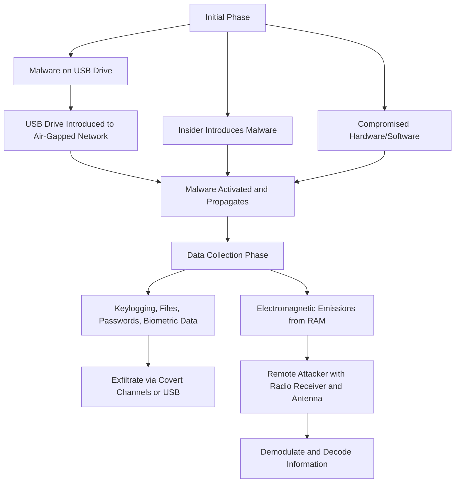

---
layout: intro
class: pl-30
glowSeed: 14
---
<h1 flex="~ col">
<div text-2xl origin-top-left transition duration-500 :class="$clicks <= 2 ? 'scale-150' : 'op50'">
  <span v-click> Hacking air-gap computers using </span>
  <span> RAM</span>

</div>
<div mt1 forward:delay-300 v-click>RAMBO</div>
</h1>

<div abs-br mx-10 mb-10 flex="~ col gap-4 items-end" text-left v-click="1">
  <div text-sm opacity-75 mt--4>Dec. 23th 2024</div>
</div>

---
---
# What is Air-Gap Computers
An air gap computer is a computer that is not connected to any network, including the internet. This means that it is not possible for the computer to communicate with any other device or system, and it is therefore highly secure.

<!--
Notes:

    Air gap computers are often used in situations where the security of the information being processed is of the utmost importance.
    They can be used to prevent cyber attacks,
-->

---
---
# BUT there's way that you can hack them

<div flex flex-col gap3 h-full>
<div v-click="1" bg-blue:10 border="~ gray/50 rounded-lg">
  <div flex="~ items-center gap-2" bg-blue:10 px4 py2 rounded><div  i-solar-usb-square-broken text-xl invert-100 text-blue-4 /> USB Drive-by</div>

  <div ml2 p2 text-gray1>
  <v-clicks :at="2">

Insert a malicious USB drive into the air-gapped computer, which can install malware or exfiltrate data.
  </v-clicks>
  </div>
</div>

<div v-click="3" bg-gray:10 border="~ gray/50 rounded-lg">
  <div flex="~ items-center gap-2" bg-gray:10 px4 py2 rounded><div  i-solar:telescope-broken text-xl invert-100 text-blue-4 /> Use a telescope to see the monitor </div>

  <div ml2 p2 text-gray1>
  <v-clicks :at="4">

  </v-clicks>
  </div>
</div>
</div>

---
---
# Attacks on Air-Gapped Networks

<div flex="~ col gap-4" py6>
<span v-click>
  <div flex="~ inline" text-blue mr2 px2 rounded bg-blue:10>Send the malware</div><br>
  <span text-blue2> Involve specialized malware and physical media or insider agents</span>
</span>
<span v-click>
  <div flex="~ inline" text-rose mr2 px2 rounded bg-rose:10>collecting Data</div><br>
  <span text-rose2>Initiate malware execution, propagate within the network, and exfiltrate data</span>
</span>
<span v-click>
  <div flex="~ inline" text-yellow mr2 px2 rounded bg-yellow:10>Try to send Data</div><br>
  <span text-yellow2>Wait for another usb connection to copy files into</span>
</span>
<span v-click>
  <div flex="~ inline" text-green mr2 px2 rounded bg-green:10>Apps we can use</div><br>
  <span text-green2>Examples of APTs that have targeted air-gapped networks: USBStealer, Agent.BTZ, Stuxnet, etc.</span>
</span>
</div>

---
---
# The RAMBO Attack Scenario

<div flex="~ col gap-4" py6>
<span v-click>
  <div flex="~ inline" text-blue mr2 px2 rounded bg-blue:10>Send the malware</div><br>
  <span text-blue2> infecting the air-gapped network via USB drive or insider agent</span>
</span>
<span v-click>
  <div flex="~ inline" text-rose mr2 px2 rounded bg-rose:10>collecting Data</div><br>
  <span text-rose2> collecting information (keylogging, files, passwords, etc.) and exfiltrating it via covert electromagnetic radiation from RAM</span>
</span>
<span v-click>
  <div flex="~ inline" text-yellow mr2 px2 rounded bg-yellow:10>Get the Data</div><br>
  <span text-yellow2>Remote attacker intercepts and decodes the information using a radio receiver and antenna</span>
</span>
</div>
---
---



---
---
# BUT How to transmit data with RAM Signals
## RAM Bus Components
- **Data Bus:** Carries the actual data between the CPU and memory.

- **Address Bus:** Transports memory addresses, indicating specific locations in memory for reading or writing data.

- **Control Lines:** Handle control signals that coordinate the timing and sequence of data transfers.

---
--- 
 ## Electromagnetic Emissions

When data is transferred via the RAM bus, it involves rapid voltage and current changes, primarily in the Data Bus. These transitions create electromagnetic fields that can radiate energy as electromagnetic interference (EMI) or radio frequency interference (RFI). The frequency of these emissions depends on the bus's clock speed (measured in MHz or GHz) and other factors like data width and architecture. Faster buses (e.g., DDR4, DDR5) with wider data paths result in quicker data transfers and potentially higher emissions.
## Signal Generation
Signal Generation Data read/write operations generate electrical currents in the RAM chips and PCB traces, which produce electromagnetic fields. To create an EM covert channel, the transmitter modulates memory access patterns to encode binary data. The receiver then detects and decodes these emissions using RF receivers or EM field sensors. For instance, a specific timing interval in memory access might represent a '0', while another represents a '1'.

---
---
# Now the code
```py{1,2|5-8|10-18|15|all}
bitEndTime = getCurrentTimeMillis()  # Get the current time in milliseconds
frameStart = 0  # Initialize frameStart to 0
while frameStart < (len(bits) - frameSizeBits):
    frameBits = [1, 0, 1, 0, 1, 0, 1, 0]  # Initialize frameBits with a predefined sequence
    # Append bits from the current position to the frame
    frameBits.extend(bits[frameStart: frameStart + frameSizeBits])
    frameStart += frameSizeBits  # Move frameStart to the next segment
    frameBits.append(calcParity(frameBits))  # Append calculated parity to frameBits
    # Loop through each bit in frameBits
    for bit in frameBits:
        bitEndTime += bitTimeMillis  # Calculate the end time for the current bit
        if bit == 1:
            # While the current time is less than the bit end time
            while getCurrentTimeMillis() < bitEndTime:
                movnti(memoryAddress, value)  # Perform the non-temporal store operation
        else:
            # Sleep until the bit end time
            sleep(bitEndTime - getCurrentTimeMillis())
```

---
---
# But now how to capture the Signals ?
A USRP is a hardware device that can transmit and receive radio signals. It's a software-defined radio (SDR) platform that allows you to define the radio's behavior using software. USRPs are commonly used in research, development, and education for various applications, including wireless communication, signal processing, and spectrum analysis.


---
---
# And the result of this ?


---
---
# Can there be noises ?
yes, noise are depend the distance and how fast you're trying to send the data

| Information                      | Size              | t = 10 ms | t = 5 ms  | t = 1 ms  |
| -------------------------------- | ----------------- | --------- | --------- | --------- |
| Keylogging                       | 16 bits (per key) | realtime  | realtime  | realtime  |
| 4096 bit RSA key                 | 4096 bits         | 41.96 sec | 20.48 sec | 4.096 sec |
| Biometric information            | 10000 bits        | 100 sec   | 50 sec    | 10 sec    |
| Password                         | 128 bits          | 1.28 sec  | 0.64 sec  | 0.128 sec |
| Small image (.jpg)               | 25000 bits        | 250 sec   | 125 sec   | 25 sec    |
| A textual document (.txt, .docx) | 40000 bits        | 400 sec   | 200 sec   | 40 sec    |

---
---
# Is the way to prevent it ?
No, not really
| Solution                                       | Drawbacks                                            |
| ---------------------------------------------- | ---------------------------------------------------- |
| Zone restrictions (red-black separation)       | Cost and space limitation                            |
| Internal RAM operation jamming                 | Disruption of the RAM functionality and overhead     |
| External radio jamming of RAM frequencies      | Radio interference, high cost, and power consumption |
| Radio reduction/blocking Faraday enclosures    | Cost and maintenance                                 |

---
---
# Reference
- M. Guri, ‘RAMBO: Leaking Secrets from Air-Gap Computers by Spelling Covert Radio Signals from Computer RAM’, arXiv [cs.CR]. 2024.

---
src: ./../../reuse/thanks.md
---
